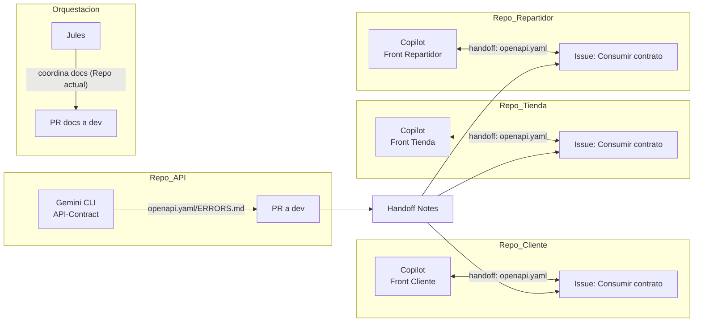

# Yega Ecosistema

## Descripción General

Este repositorio, `Yega-Ecosistema`, es el monorepo que orquesta el desarrollo de la plataforma Yega. La plataforma se compone de una API central y tres aplicaciones de frontend distintas, cada una orientada a un rol de usuario específico: clientes, repartidores y tiendas.

## Estado del Proyecto

**Fase Actual: `S1 API/Infra`**

El proyecto se encuentra en la fase de **definición del contrato de la API y la documentación de infraestructura**. El trabajo en esta fase se centra en:

- Consolidar la especificación de `openapi.yaml`.
- Definir los modelos de error (`ERRORS.md`).
- Documentar la configuración de CORS y los playbooks de despliegue.

Para más detalles sobre las fases del proyecto, consulta el documento de [orquestación y fases](./docs/agents.md).

## Arquitectura

El siguiente diagrama ilustra la interacción entre los diferentes componentes del ecosistema:



## Componentes

El ecosistema está compuesto por los siguientes sub-repositorios (submódulos de Git):

| Componente | Repositorio | Descripción |
| :--- | :--- | :--- |
| **API** | [Yega-API](./Yega-API/) | La API central que da servicio a todas las aplicaciones cliente. |
| **Cliente App** | [Yega-Cliente](./Yega-Cliente/) | La aplicación web para los clientes finales que realizan pedidos. |
| **Tienda App** | [Yega-Tienda](./Yega-Tienda/) | La aplicación web para que las tiendas gestionen su inventario y pedidos. |
| **Repartidor App** | [Yega-Repartidor](./Yega-Repartidor/) | La aplicación web para que los repartidores gestionen las entregas. |

## Cómo Contribuir

Este monorepo tiene un flujo de trabajo de orquestación específico. Antes de contribuir, por favor revisa la [guía completa para agentes y contribuidores](./docs/agents.md).

Los puntos clave son:
- **Repositorio de Orquestación**: Este repositorio (`Yega-Ecosistema`) se usa para gestionar la documentación, la planificación y los artefactos de coordinación (`handoffs`). **No se escribe código de aplicación aquí.**
- **Flujo de PRs**: Todo el trabajo se realiza en ramas (`feat/<nombre>`, `docs/<nombre>`) y se integra a `dev` a través de Pull Requests. `main` es una rama protegida.
- **Handoffs Cross-Repo**: Cualquier cambio que deba ser implementado en los sub-repositorios (`Yega-API`, `Yega-Cliente`, etc.) se documenta aquí primero y luego se transfiere como un `issue` o `PR` en el repositorio correspondiente.

## Cómo Empezar

Para configurar el entorno de desarrollo, sigue estos pasos. El proceso implica clonar este repositorio central y luego inicializar los submódulos de Git que contienen los componentes individuales (API, apps de frontend).

```sh
# 1. Clona el repositorio principal (Yega-Ecosistema)
git clone <URL_DEL_REPO_YEGA_ECOSISTEMA>
cd Yega-Ecosistema

# 2. Inicializa, descarga y actualiza los submódulos
# Este comando descarga el código de Yega-API, Yega-Cliente, etc.
git submodule init
git submodule update --recursive
```

Una vez clonado el repositorio y los submódulos, consulta la [guía de contribución](./docs/agents.md) para entender el flujo de trabajo y cómo ejecutar cada componente.

## Licencia

Este proyecto se distribuye bajo la licencia [PENDIENTE]. Por favor, actualiza esta sección con la licencia correspondiente.

## Detalles de los Componentes

### Yega-API

- **Propósito**: API central de la plataforma.
- **Documentación**: La especificación completa de la API se encuentra en el archivo [openapi.yaml](./Yega-API/contracts/openapi.yaml).

### Aplicaciones Frontend

Todas las aplicaciones de frontend comparten una pila de tecnología similar y siguen los mismos pasos básicos para la configuración y ejecución local.

- **Tecnologías Comunes**:
  - Vite
  - React
  - TypeScript
  - shadcn/ui
  - Tailwind CSS

- **Pasos para Ejecutar (ejemplo con `Yega-Cliente`)**:

  ```sh
  # 1. Navega al directorio del componente
  cd Yega-Cliente

  # 2. Instala las dependencias
  npm install

  # 3. Inicia el servidor de desarrollo
  npm run dev
  ```

  Repite estos pasos para `Yega-Tienda` y `Yega-Repartidor` según sea necesario. Para más detalles sobre cada aplicación, consulta el `README.md` dentro de su respectivo directorio.
